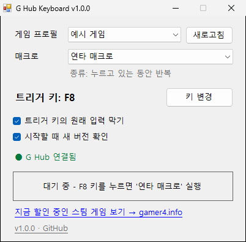

# G Hub Keyboard

키보드의 아무 키로 **Logitech G HUB 매크로**를 실행하는 작은 Windows 프로그램입니다.
마우스 버튼에만 걸 수 있던 G HUB 매크로를, 로지텍이 아닌 일반 키보드의 키로도 실행할 수 있습니다.

> **비공식 도구입니다.** Logitech과 관계없으며, Logitech이 만들거나 보증한 프로그램이 아닙니다.
> "Logitech", "G HUB"는 Logitech의 상표입니다.

[English](#english)



## 특징

- G HUB에 만들어 둔 매크로 목록을 **자동으로 불러와서** 고르기만 하면 됩니다
- 새 버전이 나오면 창 하단에 알려 줍니다
- 트리거 키를 누르면 매크로 시작, 떼면 멈춤. **마우스 버튼에 할당한 것과 똑같이** 동작합니다
  - 누르고 있는 동안 반복 / 토글 / 한 번 실행 등 G HUB의 매크로 설정이 그대로 적용됩니다
- Lua 스크립트나 G HUB 설정 변경이 필요 없습니다
- 설치 없이 exe 파일 하나(약 30KB)로 실행됩니다

## 사용법

1. [Releases](../../releases)에서 zip을 받아 압축을 풀고, `GHubKeyboard.exe`를 **`C:\Program Files\GHubKeyboard\` 같은 관리자 전용 폴더**에 넣습니다 (아래 "보안 권장 사항" 참고)
2. G HUB가 켜져 있는 상태에서 `GHubKeyboard.exe`를 실행합니다 (관리자 권한 확인 창이 뜹니다)
3. 창에 **● G Hub 연결됨**이 표시되는지 확인합니다
4. **게임 프로필**과 **매크로**를 고릅니다
5. **키 변경**을 누르고, 트리거로 쓸 키를 누릅니다
6. 트리거 키를 누르면 매크로가 실행됩니다

G HUB에서 매크로를 새로 만들었다면 **새로고침**을 누르세요.

### 옵션

- **트리거 키의 원래 입력 막기**: 체크하면 트리거 키가 다른 프로그램에 전달되지 않고 매크로 실행에만 쓰입니다.
  Ctrl / Shift / Alt는 매크로가 내보내는 키와 겹칠 수 있어서 막을 수 없습니다.
  매크로가 트리거 키와 같은 키를 누르는 경우에도 이 옵션은 끄세요 (켜 두면 매크로가 바로 멈출 수 있습니다)

## 동작 원리

- 매크로 목록은 G HUB 설정 파일(`%LOCALAPPDATA%\LGHUB\settings.db`)을 **읽기만** 해서 가져옵니다
- 매크로 실행은 G HUB 앱이 내부적으로 쓰는 로컬 통신(`ws://localhost:9010`)으로
  G HUB 에이전트에 매크로 시작/멈춤(`/macro/playback`)을 요청합니다
- 그래서 키 입력은 G HUB가 내보내며, 마우스 버튼으로 실행한 것과 구분되지 않습니다
- 트리거 키가 매크로가 누르는 키와 같아도(예: Ctrl로 Ctrl 연타 매크로 실행) 동작하도록,
  G HUB 가상 키보드에서 나온 입력과 실제 키보드 입력을 구분합니다

## 알아두실 점

- **G HUB 업데이트 후 동작하지 않을 수 있습니다.** 공개 API가 아닌 G HUB 내부 통신을 사용하기 때문입니다
- **관리자 권한이 필요한 이유**: 게임이 관리자 권한으로 실행 중이면, 일반 권한 프로그램은 그 게임 위에서 누른 키를 감지할 수 없습니다
- **키보드 감지에 대해**: 트리거 키를 감지하기 위해 전체 키보드 입력을 확인합니다.
  키 입력을 **저장하거나 외부로 전송하지 않습니다.** 소스 코드에서 직접 확인할 수 있습니다
- **통신하는 곳**
  - 내 PC의 G HUB(`localhost:9010`): 매크로 실행
  - GitHub API(`api.github.com`): 시작할 때 최신 릴리스 **버전 번호만** 확인합니다. 새 버전이 있으면 창 하단에 알림 링크가 뜨고, 다운로드는 직접 합니다.
    이때 GitHub에는 일반 웹 접속처럼 IP 주소가 보입니다. **시작할 때 새 버전 확인**을 끄면 GitHub에 접속하지 않습니다
- **백신 / SmartScreen 경고**: 서명되지 않은 exe가 키보드 감지와 관리자 권한을 쓰기 때문에 경고가 뜰 수 있습니다.
  불안하면 아래 방법으로 직접 빌드해서 사용하세요
- 설정은 레지스트리 `HKEY_CURRENT_USER\Software\GHubKeyboard`에 저장됩니다

## 보안 권장 사항

이 프로그램은 관리자 권한으로 실행됩니다. 그래서 **일반 사용자도 파일을 넣을 수 있는 폴더**(다운로드, 바탕화면 등)에서
실행하면, 같은 PC의 악성 프로그램이 exe 옆에 가짜 파일(`.dll`, `GHubKeyboard.exe.config` 등)을 심어
관리자 권한을 얻는 데 악용할 수 있습니다.

- `C:\Program Files\GHubKeyboard\`처럼 **관리자만 쓸 수 있는 폴더에 넣고 실행**하는 것을 권장합니다
- 프로그램 자체도 DLL을 System32에서만 불러오고, 관리자 권한으로 사용자 폴더에 파일을 쓰지 않도록 만들어져 있습니다

## 주의

게임에서 매크로 사용은 **게임 이용약관에 따라 제재 대상**이 될 수 있습니다.
이 프로그램 사용에 따른 모든 책임은 사용자에게 있습니다.

## 직접 빌드하기

Windows에 기본으로 들어 있는 .NET Framework 4.x 컴파일러를 사용하므로 Visual Studio가 필요 없습니다.

```bat
build.bat            :: bin\GHubKeyboard.exe 생성
build.bat release    :: 배포용 dist\GHubKeyboard-v1.0.0.zip 까지 생성
```

## 요구 사항

- Windows 10 / 11
- Logitech G HUB (실행 중이어야 함)
- .NET Framework 4.5 이상 (Windows 10/11에 기본 포함)

## 만든 사람

지금 할인 중인 스팀 게임을 한국어·원화로 모아 보는 사이트도 운영하고 있습니다 → **[gamer4.info](https://gamer4.info)**

## 라이선스

[MIT](LICENSE)

---

## English

A small Windows tool that triggers **Logitech G HUB macros with any keyboard key**, including keys on non-Logitech keyboards.

> **Unofficial.** Not affiliated with or endorsed by Logitech. "Logitech" and "G HUB" are trademarks of Logitech.

The UI is in Korean. See the screenshot above.

### Features

- Automatically lists the macros you created in G HUB, per game profile
- Press the trigger key to start the macro and release it to stop, exactly like a mouse button assignment
  (repeat while held / toggle / play once settings are respected)
- No Lua scripts and no changes to your G HUB setup
- Shows a notice at the bottom when a new version is released
- Single ~30 KB executable, no installation

### Usage

1. Download the zip from [Releases](../../releases), extract it, and put `GHubKeyboard.exe` in an **admin-only folder**
   such as `C:\Program Files\GHubKeyboard\` (it runs elevated; running it from Downloads/Desktop allows DLL/config planting by other software)
2. With G HUB running, start `GHubKeyboard.exe` (it asks for administrator rights)
3. Check that it shows **● G Hub 연결됨** (connected)
4. Pick a game profile and a macro
5. Click **키 변경** (change key) and press the key you want to use
6. Press the trigger key to run the macro

### How it works

- Reads (read-only) the macro list from `%LOCALAPPDATA%\LGHUB\settings.db`
- Sends macro START/STOP requests (`/macro/playback`) to the G HUB agent over the local websocket
  (`ws://localhost:9010`) that the G HUB app itself uses
- Distinguishes the G HUB virtual keyboard from your real keyboard, so the trigger key can be the same key the macro presses

### Notes

- **May break after a G HUB update**, since it relies on G HUB's internal, undocumented interface
- Administrator rights are needed to detect key presses while an elevated game is in the foreground
- The keyboard hook is only used to detect the trigger key. Keystrokes are **never stored or sent anywhere**
- Network connections: G HUB on `localhost:9010` (macro playback), and `api.github.com` once at startup to check
  the latest release **version number only** (shown as a link at the bottom; nothing is downloaded; GitHub sees your IP like any web request).
  Uncheck **시작할 때 새 버전 확인** (check for updates on startup) to disable it
- Settings are stored in the registry under `HKEY_CURRENT_USER\Software\GHubKeyboard`
- Antivirus / SmartScreen may warn because it is an unsigned executable using a keyboard hook. You can build it yourself (see below)
- Using macros in games may violate the game's terms of service. **Use at your own risk.**

### Build

Uses the C# compiler included with Windows (.NET Framework 4.x). No Visual Studio needed.

```bat
build.bat            :: builds bin\GHubKeyboard.exe
build.bat release    :: also creates dist\GHubKeyboard-v1.0.0.zip
```

### Author

I also run **[gamer4.info](https://gamer4.info)**, a Korean site listing Steam games currently on sale (prices in KRW).

### License

[MIT](LICENSE)
